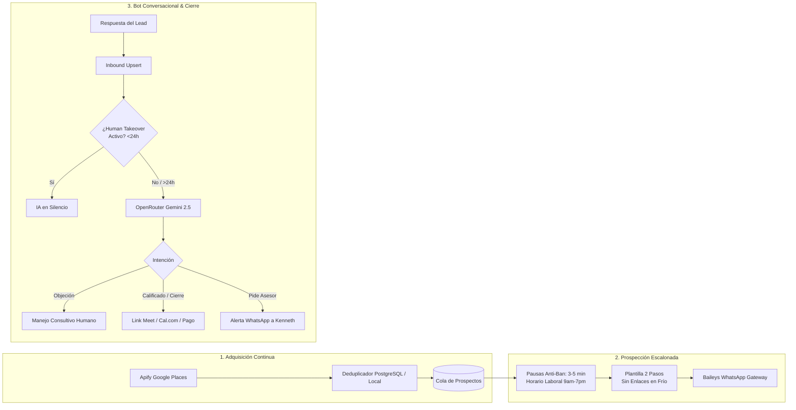

<div align="center">

# ⚡ QP Outreach Engine

**Autonomous B2B Lead Generation, Drip WhatsApp Outreach & AI Conversational Closer**

[](https://www.typescriptlang.org/)
[](https://nodejs.org/)
[](https://modelcontextprotocol.io/)
[](https://github.com/WhiskeySockets/Baileys)
[](https://apify.com)
[](https://openrouter.ai)
[](https://railway.app)
[](LICENSE)

<p align="center">
  A production-grade, 100% headless AI gateway engineered for high-ticket B2B agencies and SaaS holdings.<br/>
  <b>Acquires leads continuously with Apify, reaches out with human anti-ban cadences, and closes deals via an autonomous conversational WhatsApp bot.</b>
</p>

[Quickstart](#-guía-de-inicio-rápido-desde-cero) •
[Cómo Funciona Apify](#-1-adquisición-de-leads-con-apify) •
[Cómo se Conecta WhatsApp](#-2-conexión-y-sesión-de-whatsapp) •
[Conexión MCP para IAs](#-3-servidor-mcp-para-agentes-de-ia) •
[Comandos CLI](#-4-referencia-de-comandos-cli) •
[Despliegue en Railway](#-5-despliegue-en-producción-railway)

---

</div>

## 🏗️ Arquitectura del Sistema



---

## 🚀 Guía de Inicio Rápido (Desde Cero)

### 1. Clonar e Instalar Dependencias

```bash
git clone https://github.com/thequantpartners/qp-outreach-engine.git
cd qp-outreach-engine
npm install
```

### 2. Configurar Variables de Entorno

Copia la plantilla `.env.example` a `.env`:

```bash
cp .env.example .env
```

Configura tus credenciales clave en `.env`:

| Variable | Descripción | Dónde obtenerlo |
| :--- | :--- | :--- |
| `APIFY_TOKEN` | Token de acceso para scrapers de Google Maps | [Apify Console > Settings > Integrations](https://console.apify.com/account/integrations) |
| `OPENROUTER_API_KEY` | Llave para el motor de IA del bot de WhatsApp | [OpenRouter Keys](https://openrouter.ai/keys) |
| `ADMIN_WHATSAPP_PHONE` | Tu número personal para alertas críticas (ej. `51987654321`) | Tu WhatsApp |
| `DATABASE_URL` *(Opcional)* | Conexión a PostgreSQL (Railway / Supabase) | Si se omite, usa base de datos local automática |
| `API_SECRET_KEY` | Clave maestra para autenticar llamadas REST | Genera una cadena segura (ej. `qp-secret-2026`) |

---

## 🔍 1. Adquisición de Leads con Apify

### ¿Cómo funciona?
El sistema integra el crawler oficial `compass~crawler-google-places` de Apify directamente en código. No requiere configurar actores manuales en la web.

### ¿Te pedirá el API Key?
Sí. El sistema lee `APIFY_TOKEN` desde tu `.env`. Si no está configurado, arrojará un mensaje claro con el enlace directo para crearte una cuenta gratuita en Apify.

### ¿Cómo se dispara la adquisición?
1. **Automática (Buffer Inteligente):** El orquestador continuo monitorea la base de datos. Cuando los leads no contactados bajan de 15, ejecuta scraping rotando las palabras clave y ciudades configuradas.
2. **Por MCP o CLI:** Cualquier IA o humano puede ordenar una extracción ad-hoc:
   ```bash
   node ./bin/qp-outreach.js launch --name="Clínicas Estéticas" --query="clinicas esteticas miraflores" --max=30
   ```
3. **Deduplicación Estricta:** Antes de guardar, limpia los prefijos internacionales (`+51 9...` -> `519...`) y verifica que el número no exista previamente en base de datos. **Cero prospectos duplicados.**

---

## 📲 2. Conexión y Sesión de WhatsApp

### ¿Cómo se conecta desde cero?
1. **Inicia el servicio:**
   ```bash
   npm run dev
   ```
2. **Escaneo del Código QR:**
   - En la consola aparecerá inmediatamente un **código QR en texto**:
     ```text
     ================================================================
     📲 QP OUTREACH ENGINE | ESCANEA EL CÓDIGO QR CON WHATSAPP:
     ================================================================
     ```
   - Abre **WhatsApp** en tu teléfono móvil.
   - Ve a: **Ajustes / Configuración > Dispositivos vinculados > Vincular dispositivo**.
   - Escanea el código en la pantalla.
   *(También se genera una imagen en `./storage/whatsapp_qr.png` y endpoint web `GET /api/qr?format=image` para servidores remotos).*

3. **Persistencia Automática:**
   - Una vez escaneado, la sesión se almacena en `./storage/whatsapp_auth/` y se genera un respaldo comprimido `whatsapp_auth.tar.gz`.
   - **Nunca más tendrás que volver a escanear.** Si el servidor se reinicia o se despliega en Railway (con volumen persistente), la sesión se restaura automáticamente en 2 segundos.

---

## 🤖 3. Servidor MCP para Agentes de IA

Cualquier agente de IA (**Antigravity, Cursor, Claude Desktop, Windsurf, Smith**) puede controlar este microservicio invocando herramientas nativas sin programar llamadas HTTP.

### Configuración en Claude Desktop o Cursor:

#### Modo Remoto (Servicio en Railway):
```json
{
  "mcpServers": {
    "qp-outreach": {
      "url": "https://qp-outreach-engine.up.railway.app/sse"
    }
  }
}
```

#### Modo Local (Desarrollo por Stdio):
```json
{
  "mcpServers": {
    "qp-outreach": {
      "command": "node",
      "args": ["c:/Users/Ken Ryzen/Documents/proyectos-sass/qp-outreach-engine/bin/qp-outreach.js", "mcp"]
    }
  }
}
```

### Herramientas MCP Disponibles:

| Herramienta | Argumentos Clave | Descripción |
| :--- | :--- | :--- |
| `launch_campaign` | `service_name`, `search_queries`, `outreach_template`, `ai_sales_instructions`, `closing_type` | Dispara adquisición continua, deduplica y activa prospección y bot de cierre. |
| `outreach_status` | *(ninguno)* | Verifica conexión de WhatsApp, salud y métricas del embudo. |
| `list_leads` | `status`, `search`, `limit` | Lista prospectos (`DISCOVERED`, `OUTREACH_SENT`, `REPLIED`, `QUALIFIED`, `CLOSED_WON`). |
| `get_chat_history` | `phone` | Obtiene la transcripción completa de la conversación de un lead. |
| `send_whatsapp_message` | `to`, `message` | Envío manual inmediato (silencia la IA para ese lead). |
| `toggle_human_takeover` | `phone`, `active` | Pausa (`true`) o reanuda (`false`) el bot conversacional para un contacto. |
| `trigger_scraping` | `query`, `location`, `service_id` | Scraping ad-hoc en Apify con deduplicación inmediata. |

---

## 💻 4. Referencia de Comandos CLI

El ejecutable `qp-outreach` permite interactuar con el engine desde cualquier terminal:

```bash
# Consultar estado general del engine y métricas del embudo
node ./bin/qp-outreach.js status

# Lanzar una campaña de adquisición y prospección para cualquier servicio
node ./bin/qp-outreach.js launch --name="Agentes IA" --query="inmobiliarias miraflores" --max=25

# Listar prospectos filtrando por estado
node ./bin/qp-outreach.js leads --status=REPLIED

# Leer conversación completa con un lead
node ./bin/qp-outreach.js chat 51987654321

# Enviar mensaje manual (activa Human Takeover de inmediato)
node ./bin/qp-outreach.js send 51987654321 "Buenas tardes, ¿le parece si nos reunimos a las 4pm?"

# Silenciar la IA para un lead (o reactivarla con 'off')
node ./bin/qp-outreach.js takeover 51987654321 on

# Iniciar el servidor MCP en modo stdio
node ./bin/qp-outreach.js mcp
```

---

## 🛡️ 5. Reglas de Oro Anti-Ban de Meta

1. **La Técnica del Permiso en 2 Pasos:**
   - Prohibido enviar enlaces web (`http://...`) en el **primer mensaje en frío**.
   - El primer mensaje debe ser corto (2 a 3 párrafos breves), personalizado con `{{name}}` y terminar con una pregunta de autorización (*"¿Me permite compartirle un video de 3 minutos con la arquitectura?"*).
   - El enlace de valor (Cal.com / Loom / PDF) **solo se entrega cuando el prospecto responde afirmativamente**.
2. **Cadencia Humana y Horario Comercial:**
   - Intervalos de **180 a 300 segundos (3 a 5 minutos)** entre mensajes en frío.
   - El pipeline despacha únicamente de **9:00 AM a 7:00 PM** hora local.
   - Tope de seguridad: **25 a 40 mensajes diarios** por línea telefónica.
3. **Human Takeover con Reenganche Automático:**
   - Si Kenneth responde desde su celular o la web, la IA se apaga automáticamente para ese lead.
   - Si transcurren **24 horas de inactividad**, el bot retoma el contacto con un mensaje de seguimiento cordial.

---

## ☁️ 6. Despliegue en Producción (Railway)

1. En [Railway](https://railway.app), crea un nuevo proyecto desde tu repositorio GitHub.
2. Añade un **Persistent Volume** de 2 a 5 GB montado en `/app/storage` *(crucial para que las credenciales de WhatsApp no se pierdan entre re-despliegues)*.
3. Agrega las variables de entorno en Railway:
   - `PORT=3100`
   - `APIFY_TOKEN=apify_api_...`
   - `OPENROUTER_API_KEY=sk-or-v1-...`
   - `ADMIN_WHATSAPP_PHONE=51987654321`
   - `DATABASE_URL=${{Postgres.DATABASE_URL}}` *(si conectas el plugin de PostgreSQL de Railway)*
4. Railway detectará el `Dockerfile` y levantará el servicio con HTTPS automático.

---

## 📄 Licencia

Desarrollado bajo licencia MIT para **The Quant Partners**.
Arquitectura por Kenneth & Smith (2026).
