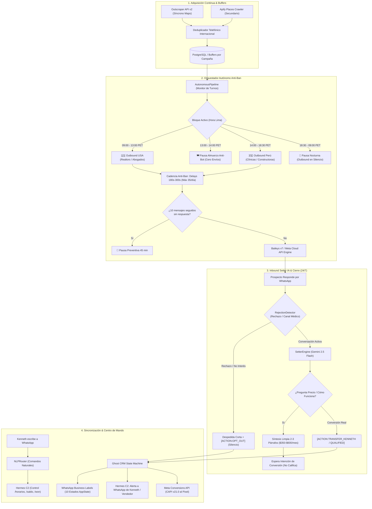
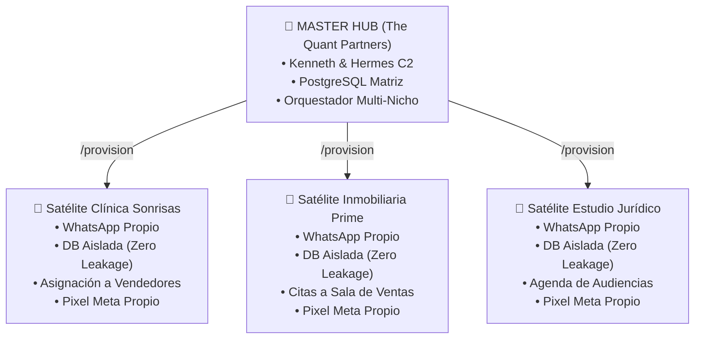
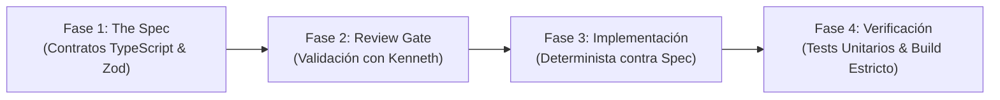

<div align="center">

# 🏛️ QP Outreach Engine & Hermes C2

**Plataforma Autónoma de Adquisición B2B, Prospección Escalonada en WhatsApp, AI Setter de Alta Conversión y Servidor MCP Nativo**

[](https://www.typescriptlang.org/)
[](https://nodejs.org/)
[](https://modelcontextprotocol.io/)
[](https://github.com/WhiskeySockets/Baileys)
[](https://outscraper.com)
[](https://openrouter.ai)
[](https://developers.facebook.com/)
[](https://railway.app)
[](LICENSE)

<p align="center">
  <b>Manual Operativo e Institucional Maestro de The Quant Partners (Kenneth & Smith)</b><br/>
  Diseñado para operar adquisiciones masivas en frío, triplicar conversiones con IA en WhatsApp Business Oficial,<br/>
  sincronizar ventas con Meta Ads y comandar toda la infraestructura directamente desde WhatsApp con Hermes C2.
</p>

[Arquitectura de Sistemas](#-1-arquitectura-global-de-sistemas) •
[Horarios y Anti-Ban](#-2-horarios-de-adquisición-y-blindaje-anti-ban-dual-region) •
[Hermes C2 en WhatsApp](#-3-hermes-c2-centro-de-mando-y-control-por-whatsapp) •
[Doctrina Comercial Setter IA](#-4-doctrina-comercial-de-cierre-y-reglas-del-setter-ia) •
[Etiquetas WhatsApp Business](#-5-sincronización-de-etiquetas-nativas-en-whatsapp-business) •
[Scraping Outscraper & Apify](#-6-adquisición-de-prospectos-outscraper-api-v2--apify) •
[Arquitectura SaaR Multi-Tenant](#-7-arquitectura-saar-multi-tenant-master-hub-vs-satélites) •
[Servidor MCP para IAs](#-8-servidor-mcp-nativo-para-agentes-de-ia-y-api-rest) •
[Despliegue en Producción](#-9-guía-de-despliegue-en-producción-railway--docker) •
[Metodología SDD](#-10-metodología-de-desarrollo-spec-driven-development-sdd)

---

</div>

## 🏛️ Identidad, Misión y Ecosistema

**`QP Outreach Engine`** es el corazón comercial y tecnológico de **The Quant Partners**. Opera como un microservicio headless que desacopla la adquisición y atención comercial del tiempo de las personas:

* **Ecosistema:** The Quant Partners.
* **El Dúo Estratégico:**
  * **Kenneth Herrera:** Fundador, estratega comercial y cerrador de cuentas clave.
  * **Smith / Antigravity:** Agente Copiloto de Inteligencia Artificial a cargo de la arquitectura, operaciones autónomas, control del pipeline y desarrollo de software.
* **Misión Central:**
  1. Adquirir prospectos calificados B2B de forma continua y limpia en Google Maps (Perú y USA).
  2. Iniciar prospección en frío con cadencia humana y técnica de permiso en 2 pasos para proteger la línea contra bloqueos de Meta.
  3. Atender consultas en 5 segundos (24/7), filtrar a los curiosos sin presupuesto y entregar a los vendedores únicamente prospectos listos para comprar.
  4. Permitir que la gerencia y los vendedores comanden todo el sistema directamente por WhatsApp (sin plataformas web complejas ni descargas de software).
  5. Conectar como Servidor MCP Nativo para que cualquier Agente de IA externo controle la empresa.

---

## 🏗️ 1. Arquitectura Global de Sistemas



---

## ⏰ 2. Horarios de Adquisición y Blindaje Anti-Ban (Dual-Region)

Para cumplir con las normativas anti-spam de Meta (2026) y proteger el número de WhatsApp, el orquestador continuo (`autonomous_pipeline.ts`) **divide el día en turnos regionales estrictos tomando la Zona Horaria de Lima (PET / UTC-5)**:

### 🕒 Matriz de Horarios Outbound (Prospección en Frío)

| Bloque | Horario (Hora Lima / PET) | Región Activa | Campañas Despachadas | Comportamiento del Motor |
| :--- | :---: | :---: | :--- | :--- |
| 🇺🇸 **Mañanas USA** | **09:00 AM – 01:00 PM** | **USA** | Realtors en Florida/Texas, Abogados de Inmigración, MedSpas USA. | Activa 50% de la cuota diaria. Prospección fría en inglés o español latino según el nicho. |
| 🍽️ **Almuerzo** | **01:00 PM – 02:00 PM** | *Pausa Total* | *Ninguna* | **Cero envíos en frío**. Emula la pausa humana de almuerzo para romper patrones algorítmicos. |
| 🇵🇪 **Tardes Perú** | **02:00 PM – 06:30 PM** | **PERÚ** | Clínicas estéticas, empresas locales, constructoras, B2B. | Despacha el balance de la cuota diaria en Lima y provincias. |
| 🌙 **Pausa Nocturna** | **06:30 PM – 09:00 AM** | *Pausa Total* | *Ninguna* | Suspensión total de prospección en frío para evitar reportes por contacto fuera de oficina. |

### ⚡ La Regla Innegociable: Inbound Activo 24/7
* Los horarios restringidos aplican **EXCLUSIVAMENTE a los primeros mensajes en frío (Outbound)**.
* Si un prospecto de USA o Perú responde a las 8:00 PM, a las 11:00 PM o un domingo por la mañana, **el Setter IA responde de inmediato en 5 segundos**. La atención a prospectos que iniciaron conversación nunca duerme.

### 🛡️ Los 4 Filtros del Blindaje Anti-Ban de Meta
1. **La Técnica del Permiso en 2 Pasos:** Estrictamente prohibido enviar enlaces web (`http://...`) en el primer mensaje en frío. El primer contacto termina siempre con una pregunta de cortesía pidiendo permiso (*"¿Me permite compartirle un video de 3 minutos con la arquitectura?"*). El enlace solo se entrega tras respuesta afirmativa.
2. **Cadencia Humana Aleatoria:** Delays obligatorios de **180 a 300 segundos (3 a 5 minutos)** entre cada mensaje saliente.
3. **Tope Diario Estricto:** Máximo **35 prospectos nuevos por día** por número de teléfono.
4. **Circuit Breaker Preventivo:** Si el motor despacha **10 mensajes consecutivos en frío sin recibir ninguna respuesta**, entra automáticamente en un **enfriamiento preventivo de 45 minutos** para salvaguardar el chip.

---

## 👑 3. Hermes C2 (Centro de Mando y Control por WhatsApp)

**Hermes C2** es el copiloto operativo que permite a Kenneth y a sus clientes gerenciar toda la empresa sin abrir ninguna computadora, comunicándose directamente por WhatsApp con el número central (`51902105668`).

```
                              📱 WHATSAPP DE KENNETH (51902105668)
                                              │
                                              ▼
                                   🏛️ HERMES C2 COPILOT
                                              │
                     ┌────────────────────────┼────────────────────────┐
                     ▼                        ▼                        ▼
             Supervisión & Estado    Scraping & Adquisición    Cierre de Ventas & CAPI
           • /status (Gateway/CRM)  • /scraper (Diagnóstico)  • /won <tel> <monto>
           • /horarios (Bloques)    • /scrape <query> [max]   • Meta Conversions API
           • /saldo (Créditos)      • Auto-Recarga Buffers    • Notificación a Asesor
           • /pipeline (Ghost CRM)  • Outscraper API v2       • Sincronización Etiquetas
```

### 📋 Catálogo Completo de Comandos (Master Kenneth)

| Comando | Sintaxis / Argumentos | Descripción Operativa |
| :--- | :--- | :--- |
| **`/status`** | `/status` o `"cómo vamos"` | Estado en vivo de WhatsApp, campañas activas, prospectos en cada etapa del embudo, ingresos acumulados y balance de plataformas. |
| **`/horarios`** | `/horarios` o `"rango horario"` | Informa la hora actual de Lima (PET), el bloque activo en vivo (`Mañanas USA`, `Pausa Almuerzo`, `Tardes Perú`, `Noche`), y los parámetros anti-ban. |
| **`/saldo`** | `/saldo` o `"cuánto saldo queda"` | Saldo exacto en dólares de **Outscraper** (búsquedas Maps) y **OpenRouter** (consumo de tokens del LLM), con alertas si está bajo. |
| **`/pipeline`** | `/pipeline` o `"ver embudo"` | Resumen financiero: prospectos totales, respondieron, calificados, citas agendadas, ventas cerradas e ingresos totales en USD y PEN. |
| **`/leads`** | `/leads` o `"ver prospectos"` | Lista los prospectos calientes más recientes pendientes de contacto humano. |
| **`/lead`** | `/lead 51987654321` | Ficha técnica completa de un prospecto: empresa, necesidad detectada, estado comercial y último intercambio de chat. |
| **`/won`** | `/won 51987654321 450 USD` | **Registra una venta cerrada ganada:** actualiza Ghost CRM a `CLOSED_WON`, asigna la etiqueta dorada en WhatsApp, notifica al equipo y dispara el evento oficial `Purchase` al Pixel de Meta (CAPI). |
| **`/pausa`** | `/pausa` o `"detener prospección"` | Pausa inmediatamente todos los envíos en frío del motor outbound de forma segura. |
| **`/reanudar`** | `/reanudar` o `"continuar"` | Reactiva la prospección escalonada manteniendo la cadencia anti-ban. |
| **`/scraper`** | `/scraper` o `"estado del scraper"` | Diagnóstico de buffers por campaña: muestra cuántos prospectos no contactados quedan en cola y estado del Circuit Breaker. |
| **`/scrape`** | `/scrape clinicas esteticas 25` | Dispara una extracción inmediata en Google Maps con Outscraper API v2, deduplica en PostgreSQL e inserta en la cola de la campaña. |
| **`/mensaje`** | `/mensaje` | Previsualiza la plantilla de prospección activa con validación de variables (`{{name}}`, `{{location}}`). |
| **`/setmensaje`**| `/setmensaje <nueva plantilla>` | Edita en caliente la plantilla de prospección sin reiniciar el servidor. |
| **`/setter`** | `/setter` | Muestra el System Prompt y directivas de calificación activas en el Setter IA. |
| **`/setsetter`** | `/setsetter <instrucciones>` | Ajusta en caliente las directivas de calificación del Setter IA. |
| **`/provision`** | `/provision "Clínica X" clinicas_salud 51999... "Carlos:51911..."` | Aprovisiona una infraestructura cliente completa en un VPS o Railway en 60 segundos. |
| **`/sop`** | `/sop` o `/manual` | Envía el manual operativo y checklist de onboarding por WhatsApp. |

### 🧠 Enrutador de Lenguaje Natural (NLP Router)
Kenneth no necesita recordar la barra diagonal (`/`). El sistema incluye un analizador semántico (`nlp_router.ts`) que resuelve intenciones naturales automáticamente:
* *"¿Cómo vamos hoy?"* $\rightarrow$ Ejecuta `/status`.
* *"¿Cuál es el rango horario de adquisición de USA y Perú?"* $\rightarrow$ Ejecuta `/horarios`.
* *"¿Cuánto saldo tenemos en Outscraper?"* $\rightarrow$ Ejecuta `/saldo`.
* *"Raspar estudios de abogados surco 30"* $\rightarrow$ Ejecuta `/scrape estudios de abogados surco 30`.
* *"Para el bot un momento"* $\rightarrow$ Ejecuta `/pausa`.
* *"Sigue con los mensajes"* $\rightarrow$ Ejecuta `/reanudar`.

---

## 🎯 4. Doctrina Comercial de Cierre y Reglas del Setter IA

Tanto el bot propio de **The Quant Partners** como los bots de los **clientes satélite** están programados con una doctrina estricta de ventas consultivas orientada a cerrar clientes de alto valor sin fricción:

### 1. Precios Oficiales Estrictos (Cero Invención)
* **Tarifa Plana:** **$350 a $600 USD/mes** según el volumen de conversaciones de la empresa.
* **Modalidad:** Mes a mes por resultados (sin contratos de permanencia forzosa ni penalidades).
* **Setup:** Único de implementación llave en mano (48 a 72 horas hábiles) completamente configurado y testeado.
* **Retorno (ROI):** Se autofinancia con solo 2 a 3 ventas adicionales recuperadas en el mes.
* *Regla innegociable:* La IA tiene terminantemente prohibido inventar precios, planes o descuentos fuera de este rango.

### 2. Operación Diaria 100% por WhatsApp
* Cero software nuevo que aprender, cero apps que descargar y cero webs complicadas.
* Los asesores comerciales reciben la alerta del prospecto calificado con la necesidad detectada directo en su WhatsApp para entrar a cerrar.
* La gerencia supervisa el avance del embudo por WhatsApp, recibe reportes automáticos y registra ventas ganadas por chat con `/won`.

### 3. Los 4 Pilares de Beneficios Clave
1. **Respuesta Instantánea en 5 Segundos (24/7):** Cero prospectos perdidos o enfriados por demoras de atención humana; atiende día, noche y feriados.
2. **Filtrado Inteligente de Curiosos con IA:** Separa a los preguntones sin presupuesto para que los ejecutivos solo atiendan prospectos reales listos para comprar.
3. **Manejo 100% Nativo en WhatsApp:** Operación comercial completa sin fricción técnica para el equipo.
4. **Conexión Oficial Meta Cloud API & Meta Ads:** Conexión empresarial oficial anti-bloqueo que sincroniza ventas con el Pixel de Meta (CAPI) para abaratar el costo por lead en pauta publicitaria.

### 4. Biblioteca de Respuestas a Objeciones Típicas
* **"Ya tenemos recepcionistas o vendedores que atienden":**
  *El sistema no reemplaza a tu equipo de cierre, lo potencia. Los humanos tardan minutos u horas en contestar y pierden el 70% de su tiempo atendiendo curiosos. El sistema filtra en 5 segundos 24/7 y le entrega a tus vendedores únicamente prospectos listos para pagar.*
* **"¿Cómo lo manejamos nosotros? / ¿Tengo que usar un sistema?":**
  *Todo se opera 100% por WhatsApp. Las alertas de prospectos calificados le llegan directo a tus vendedores por chat con la necesidad detectada, y tú como gerente supervisas el embudo sin tener que descargar apps ni usar webs complejas.*
* **"¿Me pueden bloquear el número de WhatsApp? / ¿Es seguro?":**
  *Trabajamos exclusivamente sobre la infraestructura oficial de Meta (WhatsApp Cloud API) cumpliendo al 100% las normativas de 2026. Cero riesgo de baneo porque no usamos bots piratas ni envíos masivos ilegales.*
* **"¿Cómo se conecta con mis anuncios de Meta Ads (Facebook / Instagram)?":**
  *Se conecta de forma nativa con Meta Ads. Cuando tu equipo cierra una venta, el sistema dispara el evento directamente al Pixel de Meta (CAPI), enseñándole al algoritmo a buscar compradores de mayor calidad y abaratando tu costo por lead.*
* **"¿Y si el cliente pregunta algo muy técnico que el bot no sabe?":**
  *Cuenta con reglas anti-alucinación: si un cliente hace una consulta técnica fuera de base o pide presupuesto a medida, el bot avisa amablemente que transfiere la consulta al especialista humano y notifica a tu equipo de inmediato.*
* **"¿Cuánto tarda la implementación?":**
  *La entrega es llave en mano y toma entre 48 a 72 horas hábiles. Nosotros configuramos el agente, las integraciones y los flujos; ustedes solo aprueban y empiezan a recibir prospectos filtrados.*
* **"¿Tienen contrato de permanencia forzosa?":**
  *No, trabajamos mes a mes por resultados. No amarramos a nadie; si el primer mes no ven el retorno y la calidad de los prospectos, no continúan.*

### 5. Límites de Alcance Estrictos (Cero Promesas Fuera de Sistema)
* Prohibido prometer llamadas telefónicas de voz automatizadas con IA (robocalls). Esto es infraestructura de mensajería WhatsApp.
* Prohibido prometer desarrollo de aplicaciones móviles nativas para tiendas de apps (App Store / Play Store).
* Prohibido prometer volúmenes mágicos de ventas si el cliente no tiene flujo de prospectos ni pauta: el sistema triplica la conversión, pero no genera ventas de la nada.

### 6. Reglas Conversacionales en WhatsApp
* **Regla Multi-Pregunta:** Si el prospecto hace varias preguntas a la vez (precio + beneficios + funcionamiento), responde en una síntesis ágil de **2 a 3 párrafos cortos sin rodeos**, cerrando con una pregunta conversacional.
* **Pedir Información NO es Calificación:** Responder precios, beneficios o funcionamiento jamás activa la transferencia humana ni marca al lead como calificado.
* **Handoff Únicamente con Intención Real de Conversión:** Solo cuando el prospecto acepte agendar reunión, pida contratar/pagar o solicite hablar con el cerrador humano, se activa `[ACTION:TRANSFER_KENNETH]` o `[ACTION:QUALIFIED]`.
* **Blindaje Anti-Insistencia (Zero-Churn):** Si el prospecto dice que no, despedida educada en 1 sola frase corta y cierre con `[ACTION:OPT_OUT]`. Inmunidad de estado terminal para terminar cualquier bucle de ping-pong.

---

## 🏷️ 5. Sincronización de Etiquetas Nativas en WhatsApp Business

El motor sincroniza el estado comercial de cada prospecto en tiempo real con las **Etiquetas Nativas de WhatsApp Business** mediante Baileys AppState Sync. Kenneth o los vendedores pueden ver el estado exacto del lead directamente en la lista de chats de su celular:

| Estado Ghost CRM | Etiqueta en WhatsApp Business | Color Baileys | Significado Comercial |
| :--- | :--- | :---: | :--- |
| `DISCOVERED` / `QUEUED` | 🟡 **Nuevo Prospecto** | Amarillo (5) | Extraído por el scraper, en cola de prospección. |
| `OUTREACH_SENT` | 📤 **Primer Contacto** | Cyan (0) | Mensaje inicial de permiso enviado; esperando respuesta. |
| `FOLLOW_UP_SENT` | ⏳ **Seguimiento Enviado** | Azul (1) | Mensaje de seguimiento 1 o 2 despachado. |
| `REPLIED` | 💬 **En Conversación** | Naranja (2) | El prospecto respondió; el Setter IA está dialogando. |
| `QUALIFIED` | 🟢 **Interesado / Calificado** | Verde Brillante (8) | Prospecto con intención real; transferido para cierre. |
| `MEETING_SCHEDULED` | 📅 **Cita Agendada** | Morado (10) | Reunión agendada en calendario / Meet / Cal.com. |
| `CLOSED_WON` | 🏆 **Venta Cerrada** | Verde Esmeralda (9) | Venta cobrada y evento `Purchase` enviado a Meta CAPI. |
| `CLOSED_LOST` | 🔴 **No Interesado** | Rojo (14) | Prospecto declinó la propuesta amablemente. |
| `OPT_OUT` | 🚫 **Baja / Opt-Out** | Gris Oscuro (19) | Solicitud de no contacto o canal equivocado/médico. |
| `HUMAN_TAKEOVER` | 👤 **Control Humano** | Magenta (13) | Vendedor o Kenneth atendiendo manualmente (IA silenciada). |

---

## 🗺️ 6. Adquisición de Prospectos: Outscraper API v2 & Apify

El sistema cuenta con un motor de scraping híbrido de alta resiliencia:

```
                            AUTOMONITOR DE BUFFERS (CADA 60s)
                                          │
                        ¿Buffer de Campaña < 15 Prospectos?
                                ├── SÍ ──► Outscraper API v2 (Síncrono, Google Maps)
                                │          └── (Respaldo: Apify Google Places Crawler)
                                └── NO ──► Continúa despacho outbound normal
```

1. **Outscraper API v2 (Motor Primario):**
   - Ejecución síncrona en segundos (sin esperas de colas asíncronas).
   - Extrae nombre de empresa, teléfono celular/WhatsApp, dirección, sitio web, puntuación y categoría.
   - Supervisión de saldo en vivo mediante `/saldo`.
2. **Apify Google Places Crawler (Motor de Respaldo):**
   - Utilizado para rastreos profundos masivos de más de 100 prospectos por lote.
3. **Deduplicador Telefónico Internacional:**
   - Sanitiza números telefónicos eliminando espacios, guiones y símbolos (`+51 973-825-496` $\rightarrow$ `51973825496`).
   - Verifica existencia previa en PostgreSQL. **Cero prospectos duplicados en base de datos.**

---

## 🏢 7. Arquitectura SaaR Multi-Tenant (Master Hub vs Satélites)

El engine soporta el modelo **SaaR (Software as a Result)**: The Quant Partners despliega instancias dedicadas para clientes empresariales en minutos, garantizando aislamiento total de datos:



### Catálogo de Blueprints Preconfigurados (`src/master/blueprints/`)
* **`clinicas_salud.json`:** Especializado en odontología, medicina estética y centros médicos. Transparencia en valor de consulta inicial, cero diagnósticos a ciegas por chat, y 5 objeciones médicas resueltas.
* **`inmobiliarias.json`:** Especializado en desarrolladoras y corretaje corporativo. Precios base por tipología, condiciones crediticias reales y agendamiento de visitas a departamento piloto.
* **`estudios_abogados.json`:** Especializado en firmas legales corporativas y litigios. Honorarios de diagnóstico inicial, confidencialidad estricta y citas con socios.
* **`construccion_b2b.json`:** Especializado en proveedores de materiales y contratistas de obra. Precios por volumen, pliegos técnicos y líneas de crédito comercial homologadas.

### Aprovisionamiento en 60 Segundos
Desde WhatsApp con Hermes C2:
```text
/provision "Clínica Sonrisas" clinicas_salud 51999888777 "Dr. Carlos:51911122233,Dra. Maria:51944455566"
```
Hermes genera los contenedores Docker aislados, las variables de entorno sin claves maestras (**Zero Leakage Policy**) y el script de instalación listo para ejecutar en el VPS del cliente.

---

## 🤖 8. Servidor MCP Nativo para Agentes de IA y API REST

Cualquier IA (**Smith**, **Antigravity**, **Cursor**, **Claude Desktop**, **Windsurf**) puede conectarse como operador sin escribir código HTTP.

### Configuración MCP

#### Conexión Remota en Railway (Transporte SSE)
```json
{
  "mcpServers": {
    "qp-outreach": {
      "url": "https://gateway-production-2264.up.railway.app/sse"
    }
  }
}
```

#### Conexión Local en Desarrollo (Transporte Stdio)
```json
{
  "mcpServers": {
    "qp-outreach": {
      "command": "node",
      "args": ["c:/Users/Ken Ryzen/Documents/proyectos-sass/qp-outreach-engine/bin/qp-outreach.js", "mcp"]
    }
  }
}
```

### Catálogo de Herramientas MCP Clave
* `launch_campaign`: Dispara campaña completa (oferta, queries, plantilla 2 pasos, prompt del bot y cadencia anti-ban).
* `outreach_status`: Diagnóstico completo de conexión WhatsApp, salud del servicio y pipeline Ghost CRM.
* `list_leads`: Filtra prospectos por estado comercial.
* `get_chat_history`: Lee la transcripción de chat de cualquier prospecto.
* `send_whatsapp_message`: Envío manual directo (silencia la IA en Human Takeover).
* `toggle_human_takeover`: Activa o desactiva el bot para un número específico.
* `trigger_scraping`: Scraping ad-hoc con Outscraper o Apify.
* `provision_client`: Aprovisiona un nuevo cliente satélite en 60 segundos.
* `list_niche_blueprints`: Consulta las plantillas de nicho disponibles.

---

## 🚀 9. Guía de Despliegue en Producción (Railway & Docker)

### 1. Despliegue Local (Desarrollo)
```bash
# 1. Clonar repositorio
git clone https://github.com/thequantpartners/qp-outreach-engine.git
cd qp-outreach-engine

# 2. Instalar dependencias
npm install

# 3. Configurar entorno
cp .env.example .env

# 4. Iniciar en modo desarrollo
npm run dev
```

### 2. Despliegue en Producción (Railway)
1. Conecta el repositorio en [Railway](https://railway.app).
2. **Paso Crítico de Persistencia:** Agrega un **Persistent Volume** de 5 GB montado en la ruta `/app/storage` (así las sesiones de WhatsApp no se pierden tras un re-despliegue).
3. Configura las variables de entorno principales:

| Variable | Propósito | Ejemplo |
| :--- | :--- | :--- |
| `PORT` | Puerto de escucha HTTP/SSE | `3100` |
| `ADMIN_WHATSAPP_PHONE` | Celular de Kenneth para alertas y Hermes C2 | `51902105668` |
| `OUTSCRAPER_API_KEY` | Llave oficial para scraping en Google Maps | `MGQz...` |
| `OPENROUTER_API_KEY` | Llave del motor LLM (Gemini 2.5 Flash) | `sk-or-v1-...` |
| `API_SECRET_KEY` | Clave para proteger endpoints REST | `qp-master-secret-2026` |
| `DATABASE_URL` | Conexión a PostgreSQL (Railway / Supabase) | `postgresql://...` |
| `META_DATASET_ID` | Dataset / Pixel de Meta Ads para CAPI | `1234567890` |
| `META_CAPI_ACCESS_TOKEN` | Token de acceso para Conversions API de Meta | `EAA...` |

---

## 📐 10. Metodología de Desarrollo: Spec-Driven Development (SDD)

Cualquier cambio, nueva funcionalidad o refactor dentro de este repositorio debe seguir obligatoriamente el ciclo de 4 fases de **Spec-Driven Development (SDD)**:



1. **Fase 1 (The Spec):** Definir interfaces TypeScript, invariantes anti-ban y flujos antes de tocar código.
2. **Fase 2 (Review Gate):** Presentar la propuesta sintetizada a Kenneth para aprobación rápida.
3. **Fase 3 (Implementación):** Codificar respetando los contratos al 100%.
4. **Fase 4 (Verificación):** Comprobar compilación estricta (`npm run build`), pruebas unitarias automatizadas y verificar despliegue en Railway.

---

<div align="center">
  <b>The Quant Partners · 2026</b><br/>
  <i>Arquitectura de Sistemas y Operaciones por Kenneth Herrera & Smith.</i>
</div>
